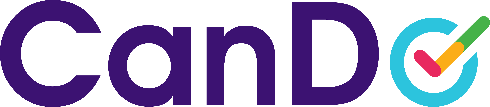
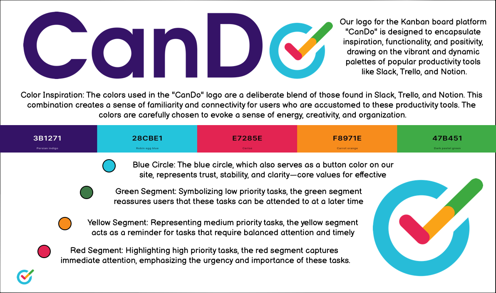
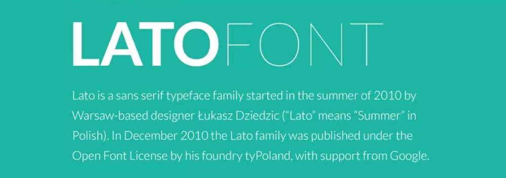
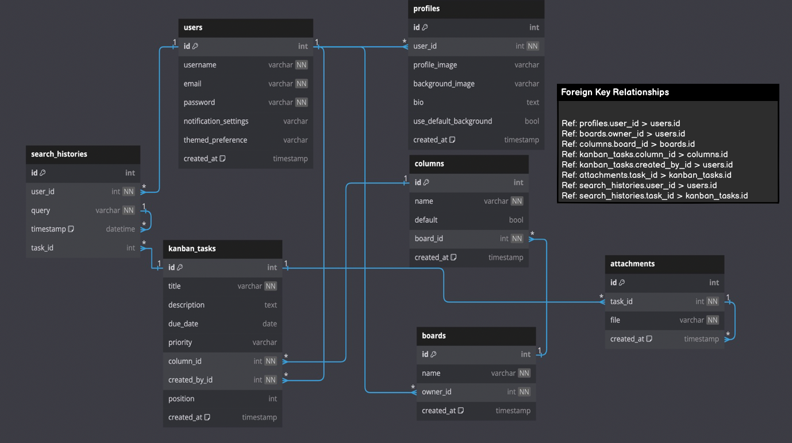

# CanDo

## Introduction:
Welcome to the Kanban Board Project, a task management application designed to streamline project workflows and enhance productivity. Developed as part of the Code Institute's Full-Stack Developer course, this project demonstrates the application of Django and Bootstrap frameworks, focusing on database manipulation and CRUD functionality.

This Kanban Board allows users to create, manage, and prioritize tasks within customizable boards and columns, providing a clear visual representation of project progress. Users can  create edit and delete tasks, ensuring effective organization. The project includes features such as user profile management, search functionality, and task notifications to support a comprehensive project management experience.

This project is intended for educational purposes only, showcasing the integration of key web development technologies and best practices.

View live site here : FreeFido

For Admin access with relevant sign-in information: Freefido Admin

## Table of Content
- [CanDo](#cando)
    - [Introduction](#introduction)
    - [Table of Content](#table-of-content)
    - [Overview](#overview)
- [UX - User Experience](#ux---user-experience)
    - [Design Inspiration](#design-inspiration)
        - [Color Scheme](#color-scheme)
        - [Font](#font)
- [Project Planning](#project-planning)
    - [Strategy](#strategy)
        - [Site Goals](#site-goals)
    - [Agile Methodologies - Project Management](#agile-methodologies---project-management)

## Overview
The Kanban Board Project is a task management application designed to streamline project workflows and enhance productivity. It is built as part of the Code Institute's Full-Stack Developer course, showcasing skills in using Django and Bootstrap frameworks, with a focus on database manipulation and CRUD functionality. This project aims to provide an efficient and intuitive tool for managing tasks within various projects.

Users are invited to: 

- Create and manage boards: Organize tasks into different boards tailored to specific projects or workflows.
- Customize columns: Define and edit columns within each board to represent different stages of task progress.
- Manage tasks: Add, edit, prioritize, and delete tasks within columns to keep track of work items.
- Personalize profiles: Update profile information including profile pictures, background images, and bios.
- Search and track history: Utilize the search functionality to quickly find tasks and maintain a history of recent searches.
- Receive notifications: Stay informed with task update notifications to keep track of progress and changes.
- Archive completed tasks: Archive tasks that are completed to maintain a clean and focused board view.

The Kanban Board Project is accessible via all browsers and is fully responsive across different screen sizes. It aims to provide a seamless user experience for individuals and teams looking to manage their projects more efficiently.

By providing these features and capabilities, the Kanban Board Project seeks to enhance task management and project organization, offering a robust solution for individual users. Future development may include additional features such as advanced user interactions, enhanced notification systems, and more sophisticated project analytics.

#### Educational Purpose:
This project is created for educational purposes, demonstrating the integration of key web development technologies and best practices. It serves as a comprehensive example of a full-stack application, leveraging Django for backend logic and database management, and Bootstrap for frontend design and responsiveness.

# UX - User Experience

## Design Inspiration
For the Kanban Board Project, my design inspiration was drawn from popular productivity tools like Trello, Slack, and Notion. These platforms are renowned for their vibrant and dynamic color palettes, which I sought to incorporate into my project to create a sense of familiarity and connectivity for users.

I was enthusiastic about developing the frontend of this project because I had a clear vision of the final product from the outset. The goal was to design a clean, modern interface that balances plenty of whitespace with colorful, eye-catching icons for each section of the website. This approach ensures that important elements stand out, making the user experience both intuitive and visually appealing.

The colors chosen were very specific and intentional, aimed at evoking a sense of energy, creativity, and organization. I meticulously applied CSS styling to ensure that each section of the site carried through the relevant colors consistently. The color scheme is inspired by the palettes used in Trello, Slack, and Notion, which are effective in creating an engaging and productive environment.

The logo itself is a deliberate blend of colors found in the productivity tools mentioned, creating a cohesive and recognizable brand identity for the Kanban Board Project.

By drawing inspiration from these successful tools, I aimed to develop an interactive and service-oriented website that not only meets the functional needs of users but also provides an enjoyable and motivating user experience.

## color Scheme

As mentioned above The colour scheme for the Kanban Board Project is meticulously designed to evoke a sense of energy, creativity, and organization. Drawing inspiration from popular productivity tools like Slack, Trello, and Notion, the chosen colours are intended to create a familiar and engaging user experience.

- **3B1271 - Persian Indigo:**
    - This deep, rich colour provides a solid foundation and represents reliability and professionalism.

- **28CBE1 - Robin Egg Blue:**
    - This vibrant blue is used to symbolize trust, stability, and clarity. It serves as a button colour on the site, reinforcing these core values.

- **E7285E - Cerise:**
    - The bold red captures attention immediately, highlighting high-priority tasks and emphasizing urgency and importance.

- **F8971E - Carrot Orange:**
    - This bright orange represents medium priority tasks, serving as a reminder for tasks that require balanced attention and timely action.

- **47B451 - Dark Pastel Green:**
    - Symbolizing low priority tasks, this green reassures users that these tasks can be attended to at a later time.

## Font

The Kanban Board Project embraces the 'Lato' font from [Google Fonts](https://fonts.google.com/specimen/Lato), selected for its elegant blend of modernity and readability. This versatile typeface brings a sophisticated and polished look to the application, ensuring that text is both visually appealing and easy to read across all devices. The choice of 'Lato' enhances the user experience by providing a seamless and professional aesthetic that complements the vibrant color scheme and dynamic interface of the Kanban Board Project.

# Project Planning

## Strategy

Effective project planning was crucial for the Kanban Board Project. I began with comprehensive market research, analyzing similar sites like Trello, Slack, and Notion to understand industry standards and user expectations. This research helped me identify key features and design elements to incorporate into the project.

I then created detailed task breakdowns, set timelines, and defined milestones. Each task was meticulously documented, prioritized, and assigned deadlines to ensure a smooth workflow and timely completion. Regular reviews and adjustments kept the project on track.

By combining market research insights with structured planning and continuous feedback loops, I established a strong foundation for developing a robust, intuitive, and visually appealing Kanban board application.

# Site Goals

- Streamline Task Management: Provide users with an intuitive platform to create, manage, and prioritize their tasks efficiently.

- Enhance Productivity: Implement features like due dates, priority settings, and notifications to help users stay organized and productive.

- Offer Customizability: Allow users to personalize their boards and columns to fit their specific project workflows and preferences.

- Ensure Accessibility: Design a responsive interface that works seamlessly across all devices and browsers, making the tool accessible anytime, anywhere.

- Facilitate Easy Navigation: Develop a user-friendly layout that ensures easy navigation and quick access to all features and functionalities.

- Provide Visual Appeal: Utilize a modern, clean design with a carefully chosen color scheme and typography to create a visually appealing user experience.

## Agile Methodologies - Project Management

Adopting Agile methodologies was pivotal in managing the Kanban Board Project. Agile principles emphasize iterative development, flexibility, and customer feedback, which align perfectly with the project's goals. Utilizing [Github Projects Board ](https://github.com/users/wgwhitecoding/projects/8/views/1), for planning and documenting my work was particularly beneficial. As I was developing a Kanban board application, using a similar tool for project management proved to be both inspirational and practical.

The GitHub Projects board provided a clear visual representation of tasks, progress, and priorities. This not only kept me organized but also allowed me to experience firsthand the benefits of a well-structured Kanban board. Every day, as I moved tasks from 'To Do' to 'In Progress' and finally to 'Done,' I gained insights and ideas that directly influenced the development of the Kanban Board Project.

The iterative nature of Agile allowed me to continuously improve the project. Regular reviews and adjustments ensured that the application evolved in line with user needs and feedback. This approach fostered a dynamic development environment, where adaptability and ongoing enhancement were key.

Using the GitHub Projects board for this project was a testament to the effectiveness of Kanban boards in managing workflows and maintaining productivity. It reinforced the importance of Agile methodologies in software development, driving home the value of iterative progress and constant refinement.

## Database Schema - Entity Relationship Diagram

