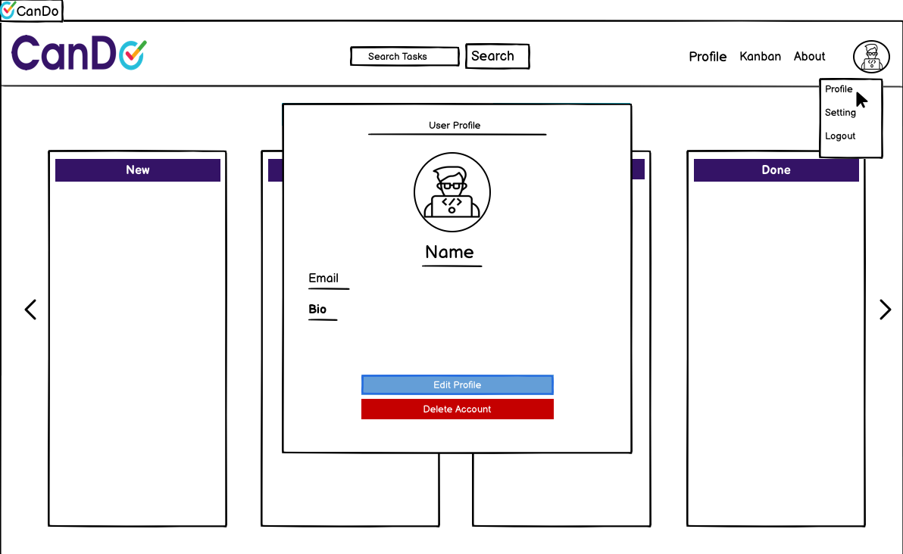

# CanDo


## Introduction:
Welcome to the Kanban Board Project, a task management application designed to streamline project workflows and enhance productivity. Developed as part of the Code Institute's Full-Stack Developer course, this project demonstrates the application of Django and Bootstrap frameworks, focusing on database manipulation and CRUD functionality.

This Kanban Board allows users to create, manage, and prioritize tasks within customizable boards and columns, providing a clear visual representation of project progress. Users can  create edit and delete tasks, ensuring effective organization. The project includes features such as user profile management, search functionality,Drag and drop and task notifications to support a comprehensive project management experience.

This project is intended for educational purposes only, showcasing the integration of key web development technologies and best practices.


View live site here : [Cando](https://cando-ci-6dea2075e664.herokuapp.com/accounts/login/)

For Admin access with relevant sign-in information: [Cando Admin](https://cando-ci-6dea2075e664.herokuapp.com/admin/login/?next=/admin/)


## Table of Content
- [CanDo](#cando)
    - [Introduction](#introduction)
    - [Table of Content](#table-of-content)
    - [Overview](#overview)
- [UX - User Experience](#ux---user-experience)
    - [Design Inspiration](#design-inspiration)
        - [Color Scheme](#color-scheme)
        - [Font](#font)
- [Project Planning](#project-planning)
    - [Strategy](#strategy)
        - [Site Goals](#site-goals)
    - [Agile Methodologies - Project Management](#agile-methodologies---project-management)
        - [MoSCoW Prioritization](#moscow-prioritization)
        - [Sprints](#sprints)
        - [User Stories](#user-stories)
            - [Manage Columns](#manage-columns)
            - [Manage Tasks](#manage-tasks)
            - [Move Tasks Between Columns](#move-tasks-between-columns)
            - [Assign Due Dates to Tasks](#assign-due-dates-to-tasks)
            - [Set Task Priorities](#set-task-priorities)
            - [Archive Completed Tasks](#archive-completed-tasks)
        - [User Stories: User](#user-stories-user)
            - [Edit Profile Information](#edit-profile-information)
            - [Search and Maintain Search History](#search-and-maintain-search-history)
            - [Manage Account Settings](#manage-account-settings)
        - [User Stories: Board Owner/Member](#user-stories-board-ownermember)
            - [Manage Task Attachments](#manage-task-attachments)
        - [Receive Task Update Notifications](#receive-task-update-notifications)
- [Scope Plane](#scope-plane)
- [Skeleton \& Surface Planes](#skeleton--surface-planes)
    - [Wireframes](#wireframes)
    - [Database Schema - Entity Relationship Diagram](#database-schema---entity-relationship-diagram)
    - [Security](#security)
- [Features](#features)
    - [User View - Registered/Unregistered](#user-view---registeredunregistered)
    - [CRUD Functionality](#crud-functionality)
    - [Feature Showcase](#feature-showcase)
    - [Responsiveness](#responsiveness) 
    - [Django Admin Interface](#responsiveness)
    - [Future Features](#future-features)
   
- [Technologies \& Languages Used](#technologies--languages-used)
  - [Libraries \& Frameworks](#libraries--frameworks)
  - [Tools \& Programs](#tools--programs)
- [Testing](#testing)
- [Deployment](#deployment)
  - [Connecting to GitHub](#connecting-to-github)
  - [Django Project Setup](#django-project-setup)
  - [Cloudinary API](#cloudinary-api)
  - [Heroku deployment](#heroku-deployment)
  - [Clone project](#clone-project)
  - [Fork Project](#fork-project)
- [Media](#media)
- [Contact me](#-connect-with-me)


## Overview
The Kanban Board Project is a task management application designed to streamline project workflows and enhance productivity. It is built as part of the Code Institute's Full-Stack Developer course, showcasing skills in using Django and Bootstrap frameworks, with a focus on database manipulation and CRUD functionality. This project aims to provide an efficient and intuitive tool for managing tasks within various projects.

Users are invited to: 

- manage board: Organize tasks into different columns tailored to specific projects or workflows.
- Customize columns: Define and edit columns within each board to represent different stages of task progress.
- Manage tasks: Add, edit, prioritize, and delete tasks within columns to keep track of work items.
- Personalize profiles: Update profile information including profile pictures, background images, and bio.
- Search and track history: Utilize the search functionality to quickly find tasks and maintain a history of recent searches.
- Receive notifications: Stay informed with task update notifications to keep track of progress and changes.
- Archive completed tasks: Archive tasks that are completed to maintain a clean and focused board view.

The Kanban Board Project is accessible via all browsers and is fully responsive across different screen sizes. It aims to provide a seamless user experience for individuals and teams looking to manage their projects more efficiently.

By providing these features and capabilities, the Kanban Board Project seeks to enhance task management and project organization, offering a robust solution for individual users. Future development may include additional features such as advanced user interactions, enhanced notification systems, and more sophisticated project analytics.

#### Educational Purpose:
This project is created for educational purposes, demonstrating the integration of key web development technologies and best practices. It serves as a comprehensive example of a full-stack application, leveraging Django for backend logic and database management, and Bootstrap for frontend design and responsiveness.


# UX - User Experience

## Design Inspiration
For the Kanban Board Project, my design inspiration was drawn from popular productivity tools like Trello, Slack, and Notion. These platforms are renowned for their vibrant and dynamic color palettes, which I sought to incorporate into my project to create a sense of familiarity and connectivity for users.

I was enthusiastic about developing the frontend of this project because I had a clear vision of the final product from the outset. The goal was to design a clean, modern interface that balances plenty of whitespace with colorful, eye-catching icons for each section of the website. This approach ensures that important elements stand out, making the user experience both intuitive and visually appealing.

The colors chosen were very specific and intentional, aimed at evoking a sense of energy, creativity, and organization. I meticulously applied CSS styling to ensure that each section of the site carried through the relevant colors consistently. The color scheme is inspired by the palettes used in Trello, Slack, and Notion, which are effective in creating an engaging and productive environment.

The logo itself is a deliberate blend of colors found in the productivity tools mentioned, creating a cohesive and recognizable brand identity for the Kanban Board Project.

By drawing inspiration from these successful tools, I aimed to develop an interactive and service-oriented website that not only meets the functional needs of users but also provides an enjoyable and motivating user experience.

## color Scheme

As mentioned above The colour scheme for the Kanban Board Project is meticulously designed to evoke a sense of energy, creativity, and organization. Drawing inspiration from popular productivity tools like Slack, Trello, and Notion, the chosen colours are intended to create a familiar and engaging user experience.


- **3B1271 - Persian Indigo:**
    - This deep, rich colour provides a solid foundation and represents reliability and professionalism.

- **28CBE1 - Robin Egg Blue:**
    - This vibrant blue is used to symbolize trust, stability, and clarity. It serves as a button colour on the site, reinforcing these core values.

- **E7285E - Cerise:**
    - The bold red captures attention immediately, highlighting high-priority tasks and emphasizing urgency and importance.

- **F8971E - Carrot Orange:**
    - This bright orange represents medium priority tasks, serving as a reminder for tasks that require balanced attention and timely action.

- **47B451 - Dark Pastel Green:**
    - Symbolizing low priority tasks, this green reassures users that these tasks can be attended to at a later time.

## Font

The Kanban Board Project embraces the 'Lato' font from [Google Fonts](https://fonts.google.com/specimen/Lato), selected for its elegant blend of modernity and readability. This versatile typeface brings a sophisticated and polished look to the application, ensuring that text is both visually appealing and easy to read across all devices. The choice of 'Lato' enhances the user experience by providing a seamless and professional aesthetic that complements the vibrant color scheme and dynamic interface of the Kanban Board Project.


# Project Planning

## Strategy

Effective project planning was crucial for the Kanban Board Project. I began with comprehensive market research, analyzing similar sites like Trello, Slack, and Notion to understand industry standards and user expectations. This research helped me identify key features and design elements to incorporate into the project.

I then created detailed task breakdowns, set timelines, and defined milestones. Each task was meticulously documented, prioritized, and assigned deadlines to ensure a smooth workflow and timely completion. Regular reviews and adjustments kept the project on track.

By combining market research insights with structured planning and continuous feedback loops, I established a strong foundation for developing a robust, intuitive, and visually appealing Kanban board application.

# Site Goals

- Streamline Task Management: Provide users with an intuitive platform to create, manage, and prioritize their tasks efficiently.

- Enhance Productivity: Implement features like due dates, priority settings, and notifications to help users stay organized and productive.

- Offer Customizability: Allow users to personalize their boards and columns to fit their specific project workflows and preferences.

- Ensure Accessibility: Design a responsive interface that works seamlessly across all devices and browsers, making the tool accessible anytime, anywhere.

- Facilitate Easy Navigation: Develop a user-friendly layout that ensures easy navigation and quick access to all features and functionalities.

- Provide Visual Appeal: Utilize a modern, clean design with a carefully chosen color scheme and typography to create a visually appealing user experience.

## Agile Methodologies - Project Management

Adopting Agile methodologies was pivotal in managing the Kanban Board Project. Agile principles emphasize iterative development, flexibility, and customer feedback, which align perfectly with the project's goals. Utilizing [Github Projects Board ](https://github.com/users/wgwhitecoding/projects/8/views/1), for planning and documenting my work was particularly beneficial. As I was developing a Kanban board application, using a similar tool for project management proved to be both inspirational and practical.

The GitHub Projects board provided a clear visual representation of tasks, progress, and priorities. This not only kept me organized but also allowed me to experience firsthand the benefits of a well-structured Kanban board. Every day, as I moved tasks from 'To Do' to 'In Progress' and finally to 'Done,' I gained insights and ideas that directly influenced the development of the Kanban Board Project.

The iterative nature of Agile allowed me to continuously improve the project. Regular reviews and adjustments ensured that the application evolved in line with user needs and feedback. This approach fostered a dynamic development environment, where adaptability and ongoing enhancement were key.

Using the GitHub Projects board for this project was a testament to the effectiveness of Kanban boards in managing workflows and maintaining productivity. It reinforced the importance of Agile methodologies in software development, driving home the value of iterative progress and constant refinement.


### MoSCoW Prioritization

To effectively manage task prioritization in my Kanban Board Project, I employed the MoSCoW method, utilizing color-coded labels. As shown in the project board image, each task is assigned a priority level with specific colors:

- **Must Have** tasks are marked in red, indicating high priority and critical importance.
- **Should Have** tasks are labeled in orange, representing tasks that are important but not essential.
- **Could Have** tasks are in green, highlighting desirable but non-essential features.
- **Won't Have** tasks are in grey, indicating features that are not planned for this release.

This visual prioritization system helps maintain clarity and focus, ensuring that the most critical tasks are addressed first.

### Sprints


| Sprint No. | Sprint Content                   | Start/Finish Dates   |
|------------|----------------------------------|----------------------|
| #1         | Project Setup                    | 23/06/24 -> 24/06/24 |
| #2         | User Authentication & Navigation | 25/06/24 -> 27/06/24 |
| #3         | Board and Column Management      | 28/06/24 -> 30/06/24 |
| #4         | Task Management Features         | 01/07/24 -> 03/07/24 |
| #5         | Attachments and Search History   | 04/07/24 -> 06/07/24 |
| #6         | Profile Management & Notifications | 07/07/24 -> 09/07/24 |
| #7         | Frontend Development             | 10/07/24 -> 12/07/24 |
| #8         | Testing & Documentation          | 14/07/24 -> 17/07/24 |


- **Sprint #1: Project Setup**
  - **Dates:** 23/06/24 -> 24/06/24
  - Initial setup of the development environment, version control, and basic project structure.

- **Sprint #2: User Authentication & Navigation**
  - **Dates:** 25/06/24 -> 27/06/24
  - Implemented user registration, login, and logout functionalities.
  - Developed site navigation and basic layout.

- **Sprint #3: Board and Column Management**
  - **Dates:** 28/06/24 -> 30/06/24
  - Created functionalities for users to create and manage board and columns.
  - Ensured proper associations and relationships between users, boards, and columns.

- **Sprint #4: Task Management Features**
  - **Dates:** 01/07/24 -> 03/07/24
  - Developed features for creating, editing, and deleting tasks.
  - Implemented task prioritization and due date settings.

- **Sprint #5: Attachments and Search History**
  - **Dates:** 04/07/24 -> 06/07/24
  - Added functionality for uploading and managing attachments within tasks.
  - Implemented search history tracking for task searches.

- **Sprint #6: Profile Management & Notifications**
  - **Dates:** 07/07/24 -> 09/07/24
  - Developed user profile management features.
  - Implemented notification system for task updates and user actions.

- **Sprint #7: Frontend Development**
  - **Dates:** 10/07/24 -> 12/07/24
  - Focused on designing and refining the user interface.
  - Ensured responsiveness and cross-browser compatibility.

- **Sprint #8: Testing & Documentation**
  - **Dates:** 14/07/24 -> 17/07/24
  - Conducted thorough testing of all features and functionalities.
  - Prepared comprehensive project documentation and user guides.


## User Stories

User stories and features recorded and managed on [Github Projects Board ](https://github.com/users/wgwhitecoding/projects/8/views/1)


#### Manage Columns

| Completion Standards                             | Priority   |
|--------------------------------------------------|------------|
| As a **user**, I can **create new columns within a board**.    | **Must Have**  |
| As a **user**, I can **edit the name of an existing column**.  | **Must Have**|
| As a **user**, I can **delete a column if it has no tasks assigned**. | **Must Have** |

#### Manage Tasks

| Completion Standards                             | Priority   |
|--------------------------------------------------|------------|
| As a **user**, I can **create a new task and assign it to a specific column**. | **Must Have** |
| As a **user**, I can **edit the details of an existing task**.            | **Should Have**|
| As a **user**, I can **delete a task**.                                   | **Should Have** |

#### Move Tasks Between Columns

| Completion Standards                             | Priority   |
|--------------------------------------------------|------------|
| As a **user**, I can **drag and drop tasks between columns**.             | **Must Have**  |
| As a **user**, I can have the **system update the task's position based on its new column**. | **Must Have** |
| As a **user**, I can have the **system maintain the task's position within the column**. | **Must Have** |

#### Assign Due Dates to Tasks

| Completion Standards                             | Priority   |
|--------------------------------------------------|------------|
| As a **user**, I can **assign a due date to a task when creating or editing it**. | **Must Have** |
| As a **user**, I can **see the system display due dates on tasks**.       | **Must Have**  |
| As a **user**, I can **filter tasks by due date**.                        | **Could Have** |

#### Set Task Priorities

| Completion Standards                             | Priority   |
|--------------------------------------------------|------------|
| As a **user**, I can **set a priority level (Low, Medium, High, Done) when creating or editing a task**. | **Must Have** |
| As a **user**, I can **see the system visually distinguish tasks based on priority**. | **Should Have** |
| As a **user**, I can **filter tasks by priority**.                        | **Should Have** |


#### Archive Completed Tasks

| Completion Standards                             | Priority   |
|--------------------------------------------------|------------|
| As a **user**, I can **mark tasks as completed**.              | **Should Have** |
| As a **user**, I can **have completed tasks archived and moved out of active view**. | **Should Have** |
| As a **user**, I can **view and restore archived tasks if needed**. | **Should Have** |

### User Stories: User

#### Edit Profile Information

| Completion Standards                             | Priority   |
|--------------------------------------------------|------------|
| As a **user**, I can **update my profile information (name, email, bio)**. | **Should Have** |
| As a **user**, I can **upload a new profile picture**.         | **Should Have** |
| As a **user**, I can **set or remove a custom background image for my profile**. | **Could Have** |

#### Search and Maintain Search History

| Completion Standards                             | Priority   |
|--------------------------------------------------|------------|
| As a **user**, I can **search tasks by title**.                | **Must Have**  |
| As a **user**, I can **have the system record each search query and task viewed in the search history**. | **Should Have** |
| As a **user**, I can **clear my search history**.           | **Could Have** |

#### Manage Account Settings

| Completion Standards                             | Priority   |
|--------------------------------------------------|------------|
| As a **user**, I can **change my account password**.        | **Must Have**  |
| As a **user**, I can **delete my account**.                 | **Must Have**  |
| As a **user**, I can **have the system log me out upon account deletion**. | **Must Have** |

### User Stories: Board Owner/Member
#### Manage Task Attachments

| Completion Standards                             | Priority   |
|--------------------------------------------------|------------|
| As a **user**, I can **upload files as attachments to tasks**. | **Should Have** |
| As a **user**, I can **view and download task attachments**.   | **Should Have** |
| As a **user**, I can **delete attachments from tasks**.        | **Should Have** |

#### Receive Task Update Notifications

| Completion Standards                             | Priority   |
|--------------------------------------------------|------------|
| As a **user**, I can **receive notifications for task updates (creation, editing, moving, and deletion)**. | **Must Have**  |
| As a **user**, I can **view notifications in the application**.  | **Must Have**  |
| As a **user**, I can **configure notification preferences**.   | **Could Have** |

## Scope Plane

As I embarked on this project, I was acutely aware that it would serve as both a learning experience and a developmental challenge. With technologies like Django, SQL, Bootstrap, and Cloudinary being new to me, I made a conscious effort to keep the project's scope manageable and focused. Given the complexity and number of files involved, it was crucial to define and control the project's features early on to ensure the development of a viable minimum viable product (MVP).

Starting with no prior knowledge of coding, I dedicated time to learning the Django MVT (Model-View-Template) framework, which provided the foundation for building dynamic web applications. This understanding allowed me to modularize the project's structure, making it easier to expand from a basic task management tool into a comprehensive Kanban board with additional features. Following Agile Planning Methodologies, I systematically added Developer Tasks, User Stories, and Testing Tasks to my GitHub project board, organizing them into sprints to maintain a steady and structured workflow.

Essential features of my project were:

- A user-friendly interface that enhances the user experience
- Responsive design ensuring accessibility on mobile, tablet, and desktop devices
- User Authentication for secure access
- Board and Column management with full CRUD (Create, Read, Update, Delete) functionality
- Task management features including creation, editing, deletion, and prioritization
- Drag-and-drop functionality to move tasks between columns
- Profile management for personalized user experiences
- Notifications to keep users informed of task updates
- Search functionality with a maintained search history for easy task retrieval

Planning the project meticulously from the beginning allowed me to pinpoint key areas crucial for MVP completion and align them with the course's assessment criteria. This approach ensured a balanced development process, keeping both the project's feasibility and the implementation of desired features in check. By maintaining a clear focus on essential functionalities and using Agile methodologies, I successfully navigated the learning curve and achieved the project's goals.

## Skeleton & Surface Planes

### Structural Plane

The structural plane of the Kanban Board project is designed to ensure all components work seamlessly together, providing a coherent and functional user experience. The structure is laid out in a clear hierarchy, with a focus on maintainability and scalability.

### Skeleton Plane

#### Wireframes

The wireframes of the Kanban Board project outline the basic structure and layout of the application. They provide a visual guide for the placement of elements such as navigation, columns, tasks, and modals. The wireframes ensure that the user interface is intuitive and easy to navigate, providing a blueprint for the final design. the wireframs were created using Balsamiq.


- **Login Page**:

  
- **Signup Page**:

  
- **Kanban Page**:

  
- **Profile Page**:

  
- **Settings Page**:

  
- **Mobile View**:

  

#### Base HTML Template

The `base.html` template serves as the foundation for all other pages in the application. It includes common elements such as the navigation bar, modals for settings, profile management, and global CSS and JavaScript imports. This template ensures a consistent look and feel across the application and handles the inclusion of dynamic content through Django template blocks.
- **Nav code**:
  
- 
#### Navigation
The navigation bar is a crucial part of the structure, providing easy access to the main sections of the application. It includes links to the Kanban board, a search form for tasks, and a profile dropdown for authenticated users. The profile dropdown allows users to access their profile, settings, and logout options quickly.
- **NavBar**:
  

#### Modals

Several modals are implemented throughout the application to enhance user interaction without navigating away from the current page. These include:
- **Profile Modal**: Allows users to view and edit their profile information and has option to delete account.
 

- **Edit Profile Modal** : Provides options for user to add name email bio and change password.


- **Settings Modal**: Provides options for toggling dark mode and uploading custom background images.


- **Logout Confirmation Modal**: Confirms user intent to logout.


- **Task Modal**: For creating and editing tasks.


- **Column Modal**: For creating and editing columns.


- **Delete Confirmation Modal**: Ensures users confirm before deleting tasks or columns.


#### Kanban Board Interface

The core feature of the application is the Kanban board interface. It is structured to display columns and tasks dynamically:
- **Columns**: Users can create, edit, and delete columns. Each column contains a list of tasks and has a header that users can interact with.
- **Tasks**: Users can create, edit, delete, and move tasks between columns. Tasks are displayed with their title, due date, priority indicators, and any attachments.

#### Responsive Design

The application is designed to be fully responsive, ensuring accessibility on mobile, tablet, and desktop devices. Bootstrap is utilized to handle the responsive layout, making sure that the interface adjusts smoothly to different screen sizes.

#### User Authentication

User authentication is handled to secure access to the application. Users can log in, register, and manage their profiles. The profile management includes updating personal information, changing passwords, and setting profile pictures and custom background images.

- **Login Page**:


#### Search Functionality

A search functionality is integrated to allow users to quickly find specific tasks. The search bar is prominently placed in the navigation bar for easy access, and search results are displayed dynamically.

#### Database Schema - Entity Relationship Diagram


The database schema of the Kanban Board project is designed to efficiently store and retrieve data related to users, boards, columns, tasks, attachments, and search history. The Entity Relationship Diagram (ERD) provides a visual representation of the database structure, showing how the entities are related. Key entities include:

- **User**: Stores user information and authentication details.
- **Profile**: Linked to the user, storing additional profile information such as profile image and background image.
- **Board**: Represents a collection of columns and tasks owned by a user.
- **Column**: Represents a category within a board to which tasks are assigned.
- **Task**: Represents an individual task within a column, including attributes like title, description, due date, priority, and attachments.
- **Attachment**: Stores files attached to tasks.
- **Search History**: Logs user search queries and viewed tasks for easy retrieval.


#### Dark Mode

A dark mode feature is available, allowing users to switch between light and dark themes. This is implemented using a toggle switch in the settings modal, providing a better user experience based on personal preferences or environmental lighting conditions.
##### dark view


#### Notification System

The notification system is designed to keep users informed about task updates in real-time. Notifications are styled to be noticeable without being intrusive, ensuring users stay aware of important changes.


### Security

Security is a critical aspect of the Kanban Board project. Measures include:

- **User Authentication**: Secure login and registration processes to ensure only authorized users can access the application.
- **Data Encryption**: Sensitive data, such as passwords, are encrypted to protect user information.
- **File Upload Validation**: Uploaded files are validated to prevent malicious files from being uploaded.
- **Secure Connections**: The application uses HTTPS to ensure secure communication between the client and server.

By structuring the application in this way, the project ensures a robust, user-friendly experience that caters to the needs of managing tasks efficiently while maintaining a clean and intuitive interface. The combination of a well-thought-out skeleton and an appealing surface design results in an effective and engaging user experience.

### CSRF Tokens

CSRF (Cross-Site Request Forgery) tokens are included in every form to help authenticate the request with the server when the form is submitted. Absence of these tokens can leave a site vulnerable to attackers who may steal a users data.


## Features

### User View - Registered/Unregistered

It was important to make the Kanban Board accessible to both registered and unregistered users in various capacities. The following is a breakdown of the site's accessibility for registered/unregistered users:

| Feature       | Unregistered User                                                | Registered, Logged-In User                              |
|---------------|------------------------------------------------------------------|--------------------------------------------------------|
| Home Page     | Visible                                                          | Visible                                                |
| Profile       | Not Visible - Profile icon only appears for registered, logged-in users | Visible and full feature interaction available          |
| Tasks         | Not visible                                                      | Visible and full feature interaction available          |
| Columns       | Not visible                                                      | Visible and full feature interaction available          |
| Boards        | Not visible                                                      | Visible and full feature interaction available          |
| Search        | Not visible                                                      | Visible and full feature interaction available          |
| Notifications | Not visible                                                      | Visible and full feature interaction available          |

### CRUD Functionality

Users are able to Create, Read, Update, and Delete their tasks, columns, and boards. Some features make full CRUD functionality available, while others present the necessary options only. Here is the CRUD breakdown for the Kanban Board:

| Feature       | Create                      | Read                        | Update                      | Delete                      |
|---------------|-----------------------------|-----------------------------|-----------------------------|-----------------------------|
| Profile       | Created upon registration   | Yes                         | Yes                         | Full Profile deletion is available to the user |
| Tasks         | Yes                         | Yes                         | Yes                         | Yes                         |
| Columns       | Yes                         | Yes                         | Yes                         | Yes                         |
| Boards        | Yes                         | Yes                         | Yes                         | Yes                         |
| Search History| Yes (automatically recorded)| Yes                         | No                          | Yes (user can clear history)|
| Notifications | No (system generated)       | Yes                         | No                          | No                          |


### Feature Highlights

Here are some highlighted features of the Kanban Board project:

- **Kanban Board Interface**: Users can create and manage tasks within columns on a dynamic Kanban board.
- **User Profiles**: Users can create and manage their profiles, including uploading profile images and setting custom backgrounds.
- **Responsive Design**: The application is fully responsive, ensuring usability across mobile, tablet, and desktop devices.
- **Dark Mode**: Users can toggle between light and dark themes based on their preferences.
- **Search Functionality**: Users can search for tasks and maintain a search history for quick retrieval.
- **Notifications**: Users receive real-time notifications about task updates to stay informed about changes.

## Feature Showcase

The feature showcase highlights the main functionalities of the Kanban Board project, providing an in-depth look at how each feature works and benefits the user. Here are the key features along with suggested images to include:

#### 1. Kanban Board Interface

The Kanban Board Interface allows users to create, manage, and organize tasks within columns. Users can visually track the progress of tasks by moving them between columns.

##### kanban


#### 2. User Profiles

Users can create and manage their profiles, including updating personal information, uploading profile images, and setting custom backgrounds.
##### Profile


##### Edit Profile


#### 3. Task Management

Users can create, edit, delete, and prioritize tasks within the Kanban board. Each task can have a title, description, due date, priority level, and attachments.

##### Task Creation

##### Attachments


#### 4. Responsive Design

The application is fully responsive, ensuring usability across mobile, tablet, and desktop devices. Users can access the Kanban board and manage tasks from any device.

# Responsiveness 

Our Kanban Board project is designed to offer a seamless and intuitive user experience across all device types. Below is an overview of the responsive design considerations for various devices:

**Mobile Devices**
On mobile devices, the Kanban Board is optimized for smaller screens, ensuring that columns are fully visible without horizontal scrolling. The layout adapts to a single-column view, providing a clear and accessible interface for users on the go.


**Desktops**
On desktop devices, the Kanban Board takes full advantage of larger screens, displaying all columns in a spacious layout. This ensures that users have a complete overview of their tasks and projects, facilitating efficient workflow management.

**Tablets**
The tablet view enhances the user experience by maintaining a balance between visibility and accessibility. Columns are displayed side-by-side with a responsive design that adapts to different orientations, allowing for easy navigation and interaction.

 

**Laptops**
For laptop users, the Kanban Board offers a comprehensive view with multiple columns visible simultaneously. The design maximizes screen real estate, providing a detailed and organized workspace that enhances productivity.

#### 5. Dark Mode

A dark mode feature allows users to switch between light and dark themes based on their preferences, enhancing the user experience in different lighting conditions.

##### Light Mode

##### Dark Mode


#### 6. Search Functionality

Users can search for tasks and maintain a search history for quick retrieval. The search bar is prominently placed in the navigation for easy access.

#### Seach Bar
 
#### Search Results 


# Django Admin Interface

The Django Admin interface for our Kanban Board project provides a powerful and user-friendly platform for managing the application's data and user accounts. Below is an overview of the various sections and functionalities available within the admin interface:


## Accounts
- **Email addresses**: Manage and update email addresses associated with user accounts.

## Authentication and Authorization
- **Groups**: Organize users into groups and manage permissions.
- **Users**: Create, update, and delete user accounts, as well as assign permissions and groups.

## Kanban
- **Boards**: Manage Kanban boards, including creating new boards and updating existing ones.
- **Columns**: Organize tasks within boards by managing columns. Add, update, and delete columns as needed.
- **Kanban tasks**: Create, update, and delete tasks within the Kanban boards. Manage task details, priorities, and deadlines.
- **Search histories**: Review and manage search histories to monitor user activity and search patterns.

## Sites
- **Sites**: Manage different sites and domains that are associated with the project.

## Social Accounts
- **Social accounts**: Manage user accounts authenticated via social platforms.
- **Social application tokens**: Handle tokens associated with social authentication.
- **Social applications**: Configure and manage social applications for third-party authentication.

## Recent Actions
The Recent Actions panel provides a quick overview of the latest actions performed within the admin interface. This helps administrators track changes and monitor user activities effectively.

By leveraging the Django Admin interface, administrators can efficiently manage all aspects of the Kanban Board application, ensuring a smooth and organized workflow.


### Future Features

The future features section highlights potential enhancements that can further improve the user experience and functionality of the Kanban Board project. Here are some ideas for future development:

#### 1. Collaboration Features

To enhance team collaboration and project management, the following features could be implemented:
- **Real-time Collaboration**: Allow multiple users to work on the same board simultaneously with real-time updates and synchronization.
- **Task Comments**: Enable users to comment on tasks to facilitate communication and collaboration directly within the Kanban board.
- **Assign Tasks to Users**: Allow tasks to be assigned to specific users, with notifications and reminders for due dates.
- **Shared Boards**: Provide the ability to share boards with other users or teams, with customizable permissions (view, edit, comment).

#### 2. Social Media Integration

Integrating social media features can enhance user engagement and community building:
- **Social Media Sharing**: Allow users to share their boards or specific tasks on social media platforms like Facebook, Twitter, and LinkedIn.
- **Activity Feed**: Implement an activity feed to show recent actions and updates within the board, similar to social media timelines.
- **User Profiles with Social Links**: Allow users to add links to their social media profiles in their user profiles.

#### 3. Enhanced Task Management

Adding more advanced task management features can improve productivity:
- **Subtasks**: Allow users to create subtasks within a task to break down complex tasks into manageable parts.
- **Task Dependencies**: Implement task dependencies to visualize and manage task sequences and prerequisites.
- **Recurring Tasks**: Enable users to set up recurring tasks for regular activities.

#### 4. Advanced Search and Filtering

Improving the search and filtering capabilities can help users find and manage tasks more efficiently:
- **Advanced Search**: Provide advanced search options with filters for due dates, priorities, and assigned users.
- **Saved Searches and Filters**: Allow users to save frequently used search queries and filters for quick access.

#### 5. Integration with Other Tools

Integrating with other productivity and communication tools can enhance the utility of the Kanban Board:
- **Calendar Integration**: Sync tasks with calendar applications like Google Calendar or Outlook.
- **Email Notifications**: Implement email notifications for task updates, due dates, and reminders.
- **Third-Party App Integration**: Integrate with popular third-party applications like Slack, Trello, or Asana for seamless workflow management.

#### 6. Enhanced User Interface

Improving the user interface and user experience can make the application more enjoyable to use:
- **Customizable Themes**: Allow users to choose from a variety of themes and color schemes.
- **Drag-and-Drop File Uploads**: Implement drag-and-drop functionality for uploading attachments to tasks.
- **Interactive Tutorials and Help**: Provide interactive tutorials and a comprehensive help section to guide new users.

#### 7. Analytics and Reporting

Providing analytics and reporting features can help users track progress and productivity:
- **Task Completion Reports**: Generate reports on task completion rates and timelines.
- **User Activity Reports**: Track user activity and contributions within the board.
- **Project Progress Dashboards**: Visualize project progress with interactive dashboards and charts.

### Future Features Showcase

Here are some highlighted future features

- **Real-time Collaboration**: Screenshot of multiple users working on the same board.
- **Task Comments**: Screenshot showing a task with comments from different users.
- **Assign Tasks to Users**: Screenshot of a task assignment interface.
- **Social Media Sharing**: Screenshot of a board with social media sharing options.
- **Subtasks**: Screenshot showing a task with subtasks.
- **Advanced Search**: Screenshot of an advanced search interface.
- **Calendar Integration**: Screenshot of tasks synced with a calendar application.
- **Customizable Themes**: Screenshot showing different theme options.
- **Analytics and Reporting**: Screenshot of a project progress dashboard.


## Technologies & Languages Used

- **Django**
- **HTML**
- **JavaScript**
- **CSS**
- **SQL**
- **Git**
- **GitHub**
- **Cloudinary**
- **Heroku**

### Libraries & Frameworks

- **annotated-types==0.7.0**
- **asgiref==3.8.1**
- **autobahn==23.6.2**
- **Automat==22.10.0**
- **channels==4.1.0**
- **cloudinary==1.36.0**
- **constantly==23.10.4**
- **crispy-bootstrap5==2024.2**
- **daphne==4.1.2**
- **dj-database-url==2.2.0**
- **dj3-cloudinary-storage==0.0.6**
- **Django==5.0.6**
- **django-allauth==0.63.3**
- **django-bootstrap-datepicker-plus==5.0.5**
- **django-bootstrap5==24.2**
- **django-crispy-forms==2.2**
- **django-environ==0.11.2**
- **django-storages==1.14.3**
- **django-summernote==0.8.20.0**
- **django-tempus-dominus==5.1.2.17**
- **django-widget-tweaks==1.5.0**
- **djangorestframework==3.15.2**
- **gunicorn==22.0.0**
- **hyperlink==21.0.0**
- **incremental==22.10.0**
- **oauthlib==3.2.2**
- **pillow==10.3.0**
- **psycopg2-binary==2.9.9**
- **pyasn1==0.6.0**
- **pyasn1_modules==0.4.0**
- **pydantic==2.8.2**
- **pydantic_core==2.20.1**
- **pyOpenSSL==24.1.0**
- **requests-oauthlib==2.0.0**
- **service-identity==24.1.0**
- **shortuuid==1.0.13**
- **sqlparse==0.5.0**
- **Twisted==24.3.0**
- **txaio==23.1.1**
- **urllib3==2.2.1**
- **whitenoise==6.7.0**
- **zope.interface==6.4.post2**

### Tools & Programs

- **Favicons**
- **Trello**
- **Git Project**
- **Claude 3**
- **ChatGPT**
- **DBDiagram**
- **Slack**
- **Stack Overflow**
- **Coding Couch**

### Additional Tools & Programs

Other tools and programs that would have been beneficial include:

- **Jira**: For advanced project management and agile planning.
- **Postman**: For testing API endpoints.
- **Docker**: For containerization and ensuring consistent development environments.
- **VS Code Extensions**: Various extensions for improving code quality and productivity.
- **Sentry**: For error tracking and monitoring.
- **Travis CI**: For continuous integration and deployment.

# Testing

- For all testing, please refer to the [TESTING.md](TESTING.md) file.

# Deployment
  
## Connecting to GitHub  

To begin this project from scratch, you must first create a new GitHub repository using the [Code Institute's Template](https://github.com/Code-Institute-Org/ci-full-template). This template provides the relevant tools to get you started. To use this template:

1. Log in to [GitHub](https://github.com/) or create a new account.
2. Navigate to the above CI Full Template.
3. Click '**Use this template**' -> '**Create a new repository**'.
4. Choose a new repository name and click '**Create repository from template**'.
5. In your new repository space, click the purple CodeAnywhere (if this is your IDE of choice) button to generate a new workspace.

## Django Project Setup

1. Install Django and supporting libraries: 
   
- ```pip3 install 'django<4' gunicorn```
- ```pip3 install dj_database_url psycopg2```
- ```pip3 install dj3-cloudinary-storage```  
  
2. Once you have installed any relevant dependencies or libraries, such as the ones listed above, it is important to create a **requirements.txt** file and add all installed libraries to it with the ```pip3 freeze --local > requirements.txt``` command in the terminal.  
3. Create a new Django project in the terminal ```django-admin startproject cando .```
4. Create a new app eg. ```python3 mangage.py startapp kanban```
5. Add this to list of **INSTALLED_APPS** in **settings.py** - 'kanban',
6. Create a superuser for the project to allow Admin access and enter credentials: ```python3 manage.py createsuperuser```
7. Migrate the changes with commands: ```python3 manage.py migrate```
8. An **env.py** file must be created to store all protected data such as the **DATABASE_URL** and **SECRET_KEY**. These may be called upon in your project's **settings.py** file along with your Database configurations. The **env.py** file must be added to your **gitignore** file so that your important, protected information is not pushed to public viewing on GitHub. For adding to **env.py**:

- ```import os```
- ```os.environ["DATABASE_URL"]="<copiedURL>"```
- ```os.environ["SECRET_KEY"]="my_super^secret@key"```
  
For adding to **settings.py**:

- ```import os```
- ```import dj_database_url```
- ```if os.path.exists("env.py"):```
- ```import env```
- ```SECRET_KEY = os.environ.get('SECRET_KEY')``` (actual key hidden within env.py)  

9. Replace **DATABASES** with:

```
DATABASES = {
    'default': dj_database_url.parse(os.environ.get("DATABASE_URL"))
  }
```

10. Set up the templates directory in **settings.py**:
- Under ``BASE_DIR`` enter ``TEMPLATES_DIR = os.path.join(BASE_DIR, ‘templates’)``
- Update ``TEMPLATES = 'DIRS': [TEMPLATES_DIR]`` with:

```
os.path.join(BASE_DIR, 'templates'),
os.path.join(BASE_DIR, 'templates', 'allauth')
```

- Create the media, static and templates directories in top level of project file in IDE workspace.

11. A **Procfile** must be created within the project repo for Heroku deployment with the following placed within it: ```web: gunicorn freefido.wsgi```
12. Make the necessary migrations again.

## Cloudinary API 

Cloudinary provides a cloud hosting solution for media storage. All users uploaded images in the FreeFid project are hosted here.

Set up a new account at [Cloudinary](https://cloudinary.com/) and add your Cloudinary API environment variable to your **env.py** and Heroku Config Vars.
In your project workspace: 

- Add Cloudinary libraries to INSTALLED_APPS in settings.py 
- In the order: 
```
   'cloudinary_storage',  
   'django.contrib.staticfiles',  
   'cloudinary',
```
- Add to **env.py** and link up with **settings.py**: ```os.environ["CLOUDINARY_URL"]="cloudinary://...."``` 
- Set Cloudinary as storage for media and static files in settings.py:
- ```STATIC_URL = '/static/'```
```
  STATICFILES_STORAGE = 'cloudinary_storage.storage.StaticHashedCloudinaryStorage'  
  STATICFILES_DIRS = [os.path.join(BASE_DIR, 'static'), ]  
  STATIC_ROOT = os.path.join(BASE_DIR, 'staticfiles')‌  
  MEDIA_URL = '/media/'  
  DEFAULT_FILE_STORAGE = 'cloudinary_storage.storage.MediaCloudinaryStorage'
```

## Heroku deployment

To start the deployment process , please follow the below steps:

1. Log in to [Heroku](https://id.heroku.com/login) or create an account if you are a new user.
2. Once logged in, in the Heroku Dashboard, navigate to the '**New**' button in the top, right corner, and select '**Create New App**'.
3. Enter an app name and choose your region. Click '**Create App**'. 
4. In the Deploy tab, click on the '**Settings**', reach the '**Config Vars**' section and click on '**Reveal Config Vars**'. Here you will enter KEY:VALUE pairs for the app to run successfully. The KEY:VALUE pairs that you will need are your: 
   
   - **CLOUDINARY_URL**: **cloudinary://....** 
   - **DATABASE_URL**:**postgres://...** 
   - **DISABLE_COLLECTSTATIC** of value '1' (N.B Remove this Config Var before deployment),
   -  **SECRET_KEY** and value  
  
5. Add the Heroku host name into **ALLOWED_HOSTS** in your projects **settings.py file** -> ```['herokuappname', ‘localhost’, ‘8000 port url’].```
6. Once you are sure that you have set up the required files including your requirements.txt and Procfile, you have ensured that **DEBUG=False**, save your project, add the files, commit for initial deployment and push the data to GitHub.
7. Go to the '**Deploy**' tab and choose GitHub as the Deployment method.
8. Search for the repository name, select the branch that you would like to build from, and connect it via the '**Connect**' button.
9.  Choose from '**Automatic**' or '**Manual**' deployment options, I chose the 'Manual' deployment method. Click '**Deploy Branch**'.
10. Once the waiting period for the app to build has finished, click the '**View**' link to bring you to your newly deployed site. If you receive any errors, Heroku will display a reason in the app build log for you to investigate. **DISABLE_COLLECTSTATIC**  may be removed from the Config Vars once you have saved and pushed an image within your project, as can **PORT:8000**.


## Clone project

A local clone of this repository can be made on GitHub. Please follow the below steps:

1. Navigate to GitHub and log in.
2. The [Cando Repository](https://github.com/wgwhitecoding/CanDo-CiFinal) can be found at this location.
3. Above the repository file section, locate the '**Code**' button.
4. Click on this button and choose your clone method from HTTPS, SSH or GitHub CLI, copy the URL to your clipboard by clicking the '**Copy**' button.
5. Open your Git Bash Terminal.
6. Change the current working directory to the location you want the cloned directory to be made.
7. Type `git clone` and paste in the copied URL from step 4.
8. Press '**Enter**' for the local clone to be created.
9. Using the ``pip3 install -r requirements.txt`` command, the dependencies and libraries needed for Cando will be installed.
10. Set up your **env.py** file and from the above steps for Cloudinary and dbsqlite3, gather the Cloudinary API key and the database url for additon to your code.
11. Ensure that your **env.py** file is placed in your **.gitignore** file and follow the remaining steps in the above Django Project Setup section before pushing your code to GitHub.

## Fork Project

A copy of the original repository can be made through GitHub. Please follow the below steps to fork this repository:  

1. Navigate to GitHub and log in.  
2. Once logged in, navigate to this repository using this link [CanDo Repository](https://github.com/wgwhitecoding/CanDo-CiFinal).
3. Above the repository file section and to the top, right of the page is the '**Fork**' button, click on this to make a fork of this repository.
4. You should now have access to a forked copy of this repository in your Github account.
5. Follow the above Django Project Steps if you wish to work on the project. 

# Media

- Credits to Nina Mizrany a Graphic designer who created the sign in and sign up background image and logo.

  ## 🤝 Connect with Me

<div align="center">
 <p>✨ Feel free to reach out for collaborations, projects, or just a chat! ✨</p>
 
  
  <a href="https://www.linkedin.com/in/walidwillwhite/" target="_blank">
    
  </a>
  <a href="mailto:walidwillwhite@gmail.com" target="_blank">
    
  </a>
  <a href="https://wgwhitecoding.github.io/portfolio/" target="_blank">
    
  </a>
  <a href="https://wgwhitecoding.github.io/CoolSites/" target="_blank">
    
  </a>
  <a href="https://www.linkedin.com/company/techa-nalogy/?viewAsMember=true" target="_blank">
    
  </a>
</div>
<br><br>
<div align="center">
🚀 Let’s connect and build something amazing together! 🚀
</div>
