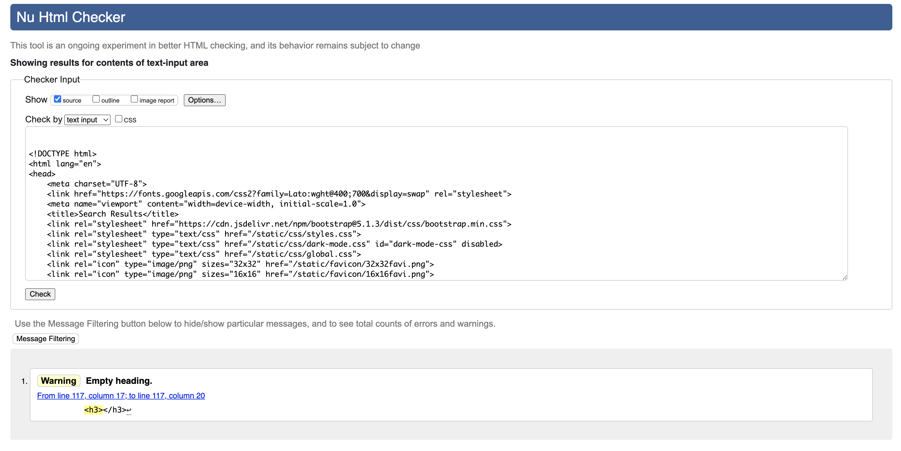
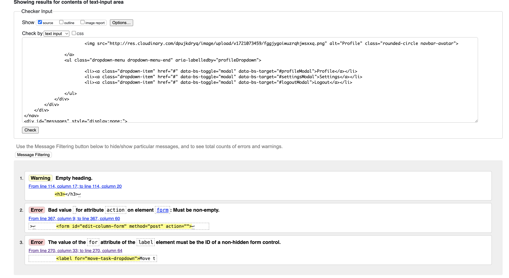
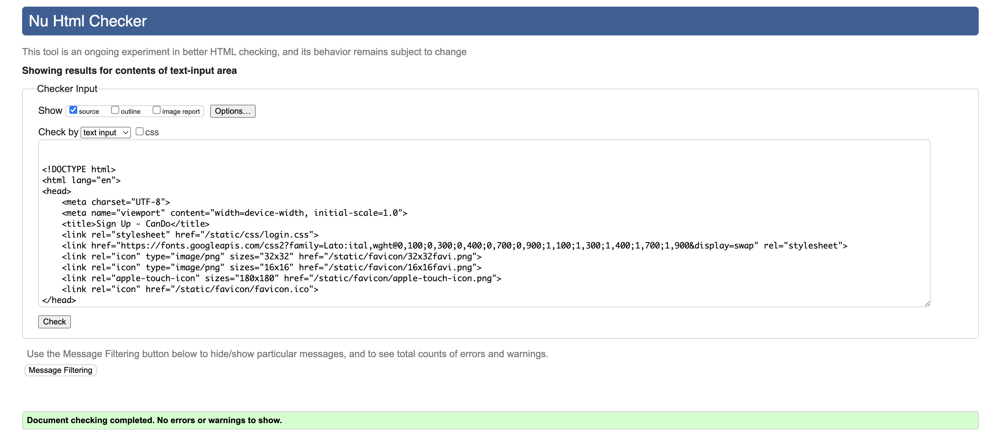
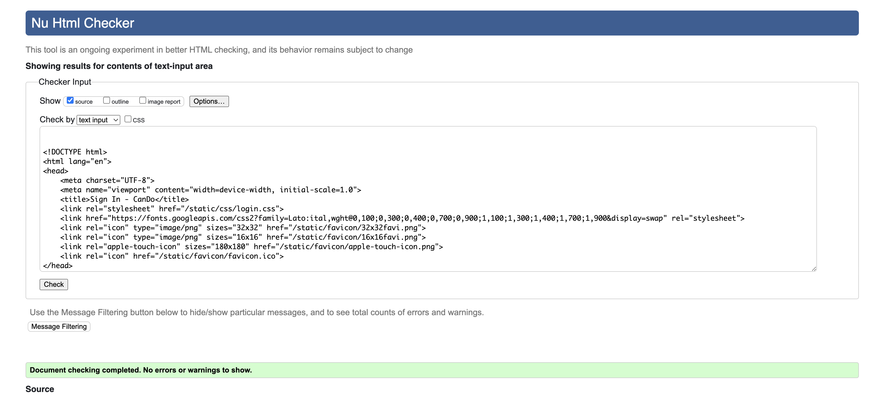
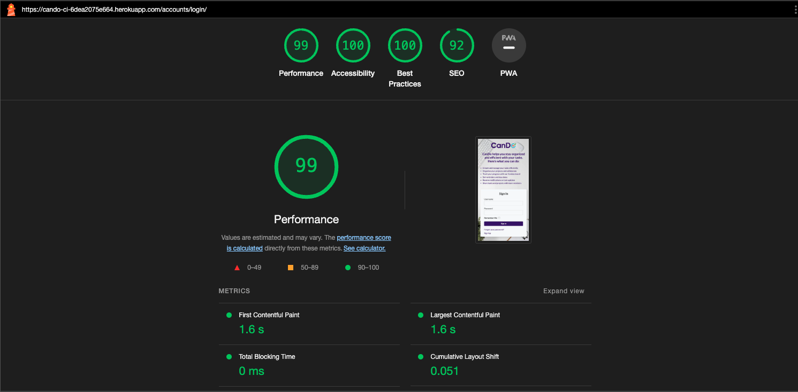
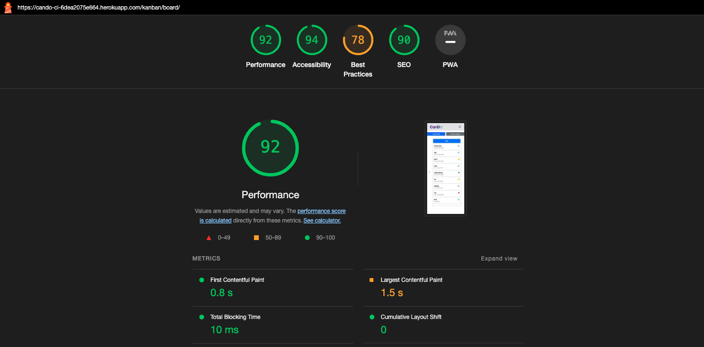
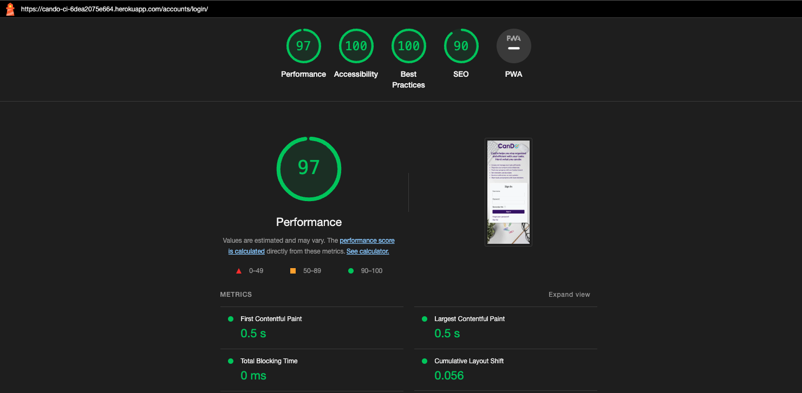
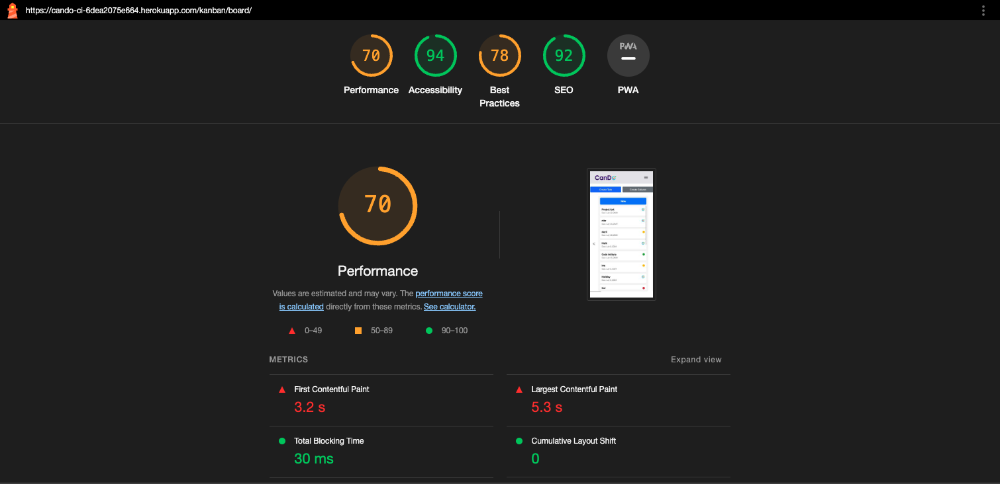
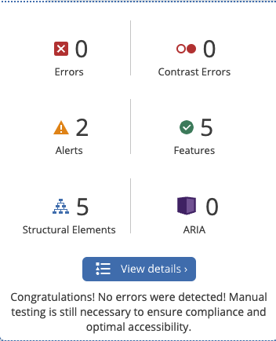

# Testing

This is the TESTING file for the [CanDo](https://cando-ci-6dea2075e664.herokuapp.com/accounts/login/) website.

Return back to the [README.md](README.md) file.

## Testing Contents  
  
- [Testing](#testing)
  - [Testing Contents](#testing-contents)
  - [Validation](#validation)
    - [HTML Validation](#html-validation)
    - [JavaScript Validation](#javascript-validation)
    - [Python Validation](#python-validation)
    - [CSS Validation](#css-validation)
    - [Lighthouse Scores](#lighthouse-scores)
    - [Wave Accessibility Evaluation](#wave-accessibility-evaluation)
  - [Manual Testing](#manual-testing)
    - [User Input/Form Validation](#user-inputform-validation)
    - [Browser Compatibility](#browser-compatibility)
    - [Testing User Stories](#testing-user-stories)
    - [Dev Tools/Real World Device Testing](#dev-toolsreal-world-device-testing)
    - [Known Bugs](#known-bugs)

## Validation

### HTML Validation
| File | W3C URL | Screenshot | Notes |
| --- | --- | --- | --- |
| search.html| [W3C](https://validator.w3.org/#validate_by_input) |   | Pass: one warning for h3 being empty this is for profile name user need to put name is thats why its not showing  |
| base.html index.html | [W3C](https://validator.w3.org/#validate_by_input) |   | 3 errors 1 same as above and the other to change action to href and label id not hidden from control left this for transparency|
| singup.html | [W3C](https://validator.w3.org/#validate_by_input) |   | Pass: No Errors |
| signin.html | [W3C](https://validator.w3.org/#validate_by_input) |   | Pass: No Errors |

  

### JavaScript Validation

[JSHint](https://jshint.com/) was used to validate JavaScript code added to the project.

| File | Jhint URL | Screenshot | Notes |
| --- | --- | --- | --- |
| dark_mode.js| [JS HINT](https://jshint.com/) |   | Pass: No Errors |
| kanban_custom.js | [JS HINT](https://jshint.com/) |   | Pass: No Errors |
| kanban.js | [JS HINT](https://jshint.com/) |   | Pass: says thre is few unused varibles but i am using them for mobile functions |
| notifications.js | [JS HINT](https://jshint.com/) |   | |
| profile.js | [JS HINT](https://jshint.com/) |   |warning to not use 'new' for side effects which i didnt quite understand how to fix|
| search.js | [JS HINT](https://jshint.com/) |    | Pass: No Errors |

### Python Validation

[CI Python Linter](https://pep8ci.herokuapp.com/#) was used to validate the Python files that were created or edited by myself. issue with my views where few lines are over by couple of characters. I have included some screenshots with the results below.

- Used [PEP8 CI Python Linter](https://pep8ci.herokuapp.com) to validate all of my Python files.

| File | CI URL | Screenshot | Notes |
| --- | --- | --- | --- |
| forms.py | [PEP8 CI](https://pep8ci.herokuapp.com/) |   | Pass: No Errors |
| settings.py | [PEP8 CI](https://pep8ci.herokuapp.com/) |   | Pass: No Errors |
| urls.py/apps | [PEP8 CI](https://pep8ci.herokuapp.com/) |   | Pass: No Errors |
| views.py | [PEP8 CI](https://pep8ci.herokuapp.com/) |   | Pass: 13errors due to long line that are 1 or 2 characters too big i am unable to change the code. |
| models.py | [PEP8 CI](https://pep8ci.herokuapp.com/) |   | Pass: No Errors |
| admin.py | [PEP8 CI](https://pep8ci.herokuapp.com/) |    | Pass: No Errors |
| signals.py | [PEP8 CI](https://pep8ci.herokuapp.com/) |   | Pass: No Errors |
| apps.py | [PEP8 CI](https://pep8ci.herokuapp.com/) |   | Pass: No Errors |
| urls/project | [PEP8 CI](https://pep8ci.herokuapp.com/) |   | Pass: No Errors |
| utils.py | [PEP8 CI](https://pep8ci.herokuapp.com/) |   | Pass: No Errors |

### CSS Validation 

[W3C CSS Validator](https://jigsaw.w3.org/css-validator/) was used to validate my CSS file.

| File | W3C URL | Screenshot | Notes |
| --- | --- | --- | --- |
| darkmode.css | [W3C](https://validator.w3.org/#validate_by_input) |   | Pass: No Errors |
| global.css | [W3C](https://validator.w3.org/#validate_by_input) |   | Pass: No Errors |
| kanban.css | [W3C](https://validator.w3.org/#validate_by_input) |   | Pass: no Errors |
| login.css | [W3C](https://validator.w3.org/#validate_by_input) |   | |
| styles.css | [W3C](https://validator.w3.org/#validate_by_input) |   | Pass: No Errors |
  

 
   
### Lighthouse Scores

Lighthouse testing was carried out in Incognito mode to acheive the best result. Performance was lower than preferred due to the site being image heavy. 

**Desktop**  

  
*Desktop login Page*  
  
   
*Desktop kanban Page*
  
**Mobile**  

 
*Mobile login Page*  
  
 
*Mobile kanban Page*
  

  

### Wave Accessibility Evaluation

  
  
I have 2 alerts but no errors errors

- **1** no page regions
- **2** missing first level header

  

## Manual Testing

### User Input/Form Validation

Testing was carried out on desktop using a Chrome browser to ensure all forms take the intended input and process the input appropriately.

# Manual Testing: User Input/Form Validation

| **Form/Page**       | **Input Field/Element**      | **Test Case**                         | **Steps**                                                   | **Expected Outcome**                                                                 | **Pass** |
|---------------------|------------------------------|---------------------------------------|-------------------------------------------------------------|--------------------------------------------------------------------------------------|----------|
| **Login Form**      | **Username**                 | **Valid username**                    | Enter a valid username and submit                           | User is logged in successfully                                                       | Bug      |
|                     |                              | **Invalid username**                  | Enter an invalid username and submit                         | Error message indicating invalid username                                            | Bug      |
|                     | **Password**                 | **Valid password**                    | Enter a valid password and submit                           | User is logged in successfully                                                       | Bug      |
|                     |                              | **Invalid password**                  | Enter an invalid password and submit                         | Error message indicating invalid password                                            | Bug      |
| **Registration Form**| **Email**                    | **Valid email**                       | Enter a valid email and submit                              | Registration successful, user account created                                        | Bug      |
|                     |                              | **Invalid email format**              | Enter an email in incorrect format and submit               | Error message indicating invalid email format                                        | Bug      |
|                     | **Password**                 | **Password match**                    | Enter matching passwords and submit                         | Registration successful, user account created                                        | Bug      |
|                     |                              | **Password mismatch**                 | Enter non-matching passwords and submit                     | Error message indicating passwords do not match                                      | Bug      |
|                     | **Profile Image**            | **Valid image file**                  | Upload a valid image file and submit                        | Profile image uploaded successfully                                                  | Pass     |
|                     |                              | **Invalid file format**               | Upload a non-image file and submit                          | Error message indicating invalid file format                                         | Pass     |
| **Search Form**     | **Search query**             | **Valid query**                       | Enter a valid query and submit                              | Relevant search results displayed                                                    | Pass     |
|                     |                              | **Empty query**                       | Leave the query field empty and submit                      | Error message indicating query cannot be empty                                       | Pass     |
| **Task Form**       | **Title**                    | **Valid title**                       | Enter a valid task title and submit                         | Task is created successfully                                                         | Pass     |
|                     |                              | **Empty title**                       | Leave the title field empty and submit                      | Error message indicating title is required                                           | Pass     |
|                     | **Due Date**                 | **Valid due date**                    | Enter a valid due date and submit                           | Task is created successfully                                                         | Pass     |
|                     |                              | **Invalid due date**                  | Enter an invalid due date (e.g., past date) and submit      | Error message indicating invalid due date                                            | Pass     |
|                     | **Priority**                 | **Valid priority selection**          | Select a valid priority and submit                          | Task is created successfully                                                         | Pass     |
|                     |                              | **No priority selection**             | Do not select any priority and submit                       | Error message indicating priority is required                                        | Pass     |
| **Profile Form**    | **Name**                     | **Valid name**                        | Enter a valid name and submit                               | Profile updated successfully                                                         | Pass     |
|                     |                              | **Empty name**                        | Leave the name field empty and submit                       | Profile updated successfully                                                         | Pass     |
|                     | **Bio**                      | **Valid bio**                         | Enter a valid bio and submit                                | Profile updated successfully                                                         | Pass     |
|                     | **Profile Image**            | **Valid image file**                  | Upload a valid image file and submit                        | Profile image uploaded successfully                                                  | Pass     |
|                     |                              | **Invalid file format**               | Upload a non-image file and submit                          | Error message indicating invalid file format                                         | Pass     |
| **Settings Form**   | **Background Image**         | **Valid image file**                  | Upload a valid image file and submit                        | Background image updated successfully                                                | Pass     |
|                     |                              | **Invalid file format**               | Upload a non-image file and submit                          | Error message indicating invalid file format                                         | Pass     |
| **Change Password Form**| **Current Password**      | **Valid current password**            | Enter correct current password and submit                   | Password changed successfully                                                        | Pass     |
|                     |                              | **Invalid current password**          | Enter incorrect current password and submit                 | Error message indicating incorrect current password                                  | Pass     |
|                     | **New Password**             | **Password match**                    | Enter matching new passwords and submit                     | Password changed successfully                                                        | Pass     |
|                     |                              | **Password mismatch**                 | Enter non-matching new passwords and submit                 | Error message indicating passwords do not match                                      | Pass     |
| **Delete Task Modal**| **Confirmation**             | **Confirm delete**                    | Confirm the delete action                                   | Task is deleted successfully                                                         | Pass     |
|                     |                              | **Cancel delete**                     | Cancel the delete action                                    | Task is not deleted                                                                  | Pass     |
| **Delete Account Modal**| **Confirmation**          | **Confirm delete**                    | Confirm the delete action                                   | Account is deleted successfully, user logged out                                     | Pass     |
|                     |                              | **Cancel delete**                     | Cancel the delete action                                    | Account is not deleted                                                               | Pass     |
| **Edit Task Modal** | **Title**                    | **Valid title**                       | Enter a valid task title and submit                         | Task is updated successfully                                                         | Pass     |
|                     |                              | **Empty title**                       | Leave the title field empty and submit                      | Error message indicating title is required                                           | Pass     |
|                     | **Due Date**                 | **Valid due date**                    | Enter a valid due date and submit                           | Task is updated successfully                                                         | Pass     |
|                     |                              | **Invalid due date**                  | Enter an invalid due date (e.g., past date) and submit      | Error message indicating invalid due date                                            | Pass     |
|                     | **Priority**                 | **Valid priority selection**          | Select a valid priority and submit                          | Task is updated successfully                                                         | Pass     |
|                     |                              | **No priority selection**             | Do not select any priority and submit                       | Error message indicating priority is required                                        | Pass     |
|                     | **Attachments**              | **Valid image file**                  | Upload a valid image file and submit                        | Attachment uploaded successfully                                                     | Pass     |
|                     |                              | **Invalid file format**               | Upload a non-image file and submit                          | Error message indicating invalid file format                                         | Pass     |
message indicating invalid file format                                         |

### Browser Compatibility

Cando was tested on the following browsers. New user accounts were created, existing user data was edited, and all features were comprehensively tested:

- Chrome v114.0.5735.199
- Firefox v114.0.2
- Edge v114.0.1823.79
- Safari v16.5.1

| Browser  | Issue                                                                 | Functionality           |
|----------|-----------------------------------------------------------------------|-------------------------|
| Chrome   | Profile Edit/Upload Image - File input 'Browse' Button centered in input field | Button works as expected |
| Firefox  | Profile Edit/Upload Image - File input 'Browse' Button centered in input field | Button works as expected |
| Firefox  | Profile Dashboard - scrollbars following Mozilla styling              | No issue                |
| Safari   | Scrollbars following Safari styling                                   | No issue                |

### Dev Tools/Real World Device Testing

Responsiveness testing for Cando was thoroughly conducted using Google Dev Tools on the devices listed below. Each feature was meticulously tested to ensure proper functionality across different screen sizes and resolutions. Occasionally, the initial page load on simulated devices displayed at an incorrect zoom level. This issue was quickly rectified by refreshing the page via the 'Cando' logo, leading to the correct display. This behavior is likely a Chrome-specific caching issue, as it did not occur on actual devices during real-world testing.

**Dev Tools Device Testing - all features tested, issues noted below**

| Device                   | Feature       | Issue                                                                                              | Fix                                                                                                  |
|--------------------------|---------------|----------------------------------------------------------------------------------------------------|-----------------------------------------------------------------------------------------------------|
| iPhone SE                | All features  | No issues                                                                                          | None needed                                                                                          |
| iPhone XR                | All features  | No issues                                                                                          | None needed                                                                                          |
| iPhone 12 Pro            | All features  | No issues                                                                                          | None needed                                                                                          |
| iPhone 14 Pro Max        | All features  | No issues                                                                                          | None needed                                                                                          |
| Pixel 7                  | All features  | No issues                                                                                          | None needed                                                                                          |
| Samsung Galaxy S8+       | All features  | No issues                                                                                          | None needed                                                                                          |
| Samsung Galaxy S20 Ultra | All features  | No issues                                                                                          | None needed                                                                                          |
| iPad Mini                | All features  | No issues                                                                                          | None needed                                                                                          |
| iPad Air                 | All features  | No issues                                                                                          | None needed                                                                                          |
| iPad Pro                 | All features  | No issues                                                                                          | None needed                                                                                          |
| Surface Pro 7            | All features  | No issues                                                                                          | None needed                                                                                          |
| Surface Duo              | All features  | No issues                                                                                          | None needed                                                                                          |
| Samsung Galaxy A51/71    | All features  | No issues                                                                                          | None needed                                                                                          |

**Real World Device Testing**

| Device                    | Feature       | Issue  | Fix  | 
|---------------------------|---------------|--------|------|
| iPhone XR                 | All features  | No issues | None needed |
| iPhone 12                 | All features  | No issues | None needed |
| iPhone 15                 | All features  | No issues | None needed |
| iPad Pro 2021             | All features  | No issues | None needed |
| iPad Air                  | All features  | No issues | None needed |
| MacBook Pro               | All features  | No issues | None needed |
| Acer Aspire 3 2019 laptop | All features  | No issues | None needed |

By extensively testing on both simulated and actual devices, we have confirmed that Cando performs reliably and responsively across a wide array of environments.

### Known Bugs

- Attachments show are succefully added but do not appaer till page is refreshed 
- Notifications for loggin page when sign in / sign up with wrong user are password are not working i am continuning to work on it after submittion to correct this.
- Sometimes when pressing create task or collum functionality does not work till user refreshs page rarely happens but it does.
- I have tested it on mobile and it works fine but the css is not as it shows on dev tools... i know how to fix this and i have but when i do it looks bad on dev-tools, not sure how it will be tested so i left it so it look good on dev-tools its a minor css fix . 
- Able to uploard images and pdfs but no other file types, cloudinary does not allow pdf for free users i installed pdf2image and usered utils to hold and convert pdfs to jpegs before sending them to clodinary 

- Not a bug... i had to create a P.A.T personal access token as i originally didnt hide my env.py file luckily nothing of importance on it during my commits but manged to hide it using a P.A.T