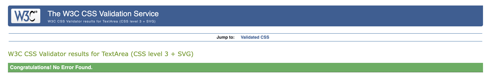

# Testing

This is the TESTING file for the [CanDo](https://cando-ci-6dea2075e664.herokuapp.com/accounts/login/) website.

Return back to the [README.md](README.md) file.

## Testing Contents  
  
- [Testing](#testing)
  - [Testing Contents](#testing-contents)
  - [Validation](#validation)
    - [HTML Validation](#html-validation)
    - [JavaScript Validation](#javascript-validation)
    - [Python Validation](#python-validation)
    - [CSS Validation](#css-validation)
    - [Lighthouse Scores](#lighthouse-scores)
    - [Wave Accessibility Evaluation](#wave-accessibility-evaluation)
  - [Manual Testing](#manual-testing)
    - [User Input/Form Validation](#user-inputform-validation)
    - [Browser Compatibility](#browser-compatibility)
    - [Testing User Stories](#testing-user-stories)
    - [Dev Tools/Real World Device Testing](#dev-toolsreal-world-device-testing)
  - [Bugs](#bugs)
    - [Known Bugs](#known-bugs)

## Validation

### HTML Validation
| File | W3C URL | Screenshot | Notes |
| --- | --- | --- | --- |
| index.html | [W3C](https://validator.w3.org/#validate_by_input) |   | Pass: No Errors |
| search.html| [W3C](https://validator.w3.org/#validate_by_input) |   | Pass: No Errors |
| base.html | [W3C](https://validator.w3.org/#validate_by_input) |   | Pass: no Errors |
| singup.html | [W3C](https://validator.w3.org/#validate_by_input) |   | |
| signin.html | [W3C](https://validator.w3.org/#validate_by_input) |   | Pass: No Errors |

  

### JavaScript Validation

[JSHint](https://jshint.com/) was used to validate JavaScript code added to the project.

| File | Jhint URL | Screenshot | Notes |
| --- | --- | --- | --- |
| dark_mode.js| [JS HINT](https://jshint.com/) |   | Pass: No Errors |
| kanban_custom.js | [JS HINT](https://jshint.com/) |   | Pass: No Errors |
| kanban.js | [JS HINT](https://jshint.com/) |   | Pass: says thre is few unused varibles but i am using them for mobile functions |
| notifications.js | [JS HINT](https://jshint.com/) |   | |
| profile.js | [JS HINT](https://jshint.com/) |   |warning to not use 'new' for side effects which i didnt quite understand how to fix|
| search.js | [JS HINT](https://jshint.com/) |    | Pass: No Errors |

### Python Validation

[CI Python Linter](https://pep8ci.herokuapp.com/#) was used to validate the Python files that were created or edited by myself. issue with my views where few lines are over by couple of characters. I have included some screenshots with the results below.

- Used [PEP8 CI Python Linter](https://pep8ci.herokuapp.com) to validate all of my Python files.

| File | CI URL | Screenshot | Notes |
| --- | --- | --- | --- |
| forms.py | [PEP8 CI](https://pep8ci.herokuapp.com/) |   | Pass: No Errors |
| settings.py | [PEP8 CI](https://pep8ci.herokuapp.com/) |   | Pass: No Errors |
| urls.py/apps | [PEP8 CI](https://pep8ci.herokuapp.com/) |   | Pass: No Errors |
| views.py | [PEP8 CI](https://pep8ci.herokuapp.com/) |   | Pass: 13errors due to long line that are 1 or 2 characters too big i am unable to change the code. |
| models.py | [PEP8 CI](https://pep8ci.herokuapp.com/) |   | Pass: No Errors |
| admin.py | [PEP8 CI](https://pep8ci.herokuapp.com/) |    | Pass: No Errors |
| signals.py | [PEP8 CI](https://pep8ci.herokuapp.com/) |   | Pass: No Errors |
| apps.py | [PEP8 CI](https://pep8ci.herokuapp.com/) |   | Pass: No Errors |
| urls/project | [PEP8 CI](https://pep8ci.herokuapp.com/) |   | Pass: No Errors |
| utils.py | [PEP8 CI](https://pep8ci.herokuapp.com/) |   | Pass: No Errors |

### CSS Validation 

[W3C CSS Validator](https://jigsaw.w3.org/css-validator/) was used to validate my CSS file.

| File | W3C URL | Screenshot | Notes |
| --- | --- | --- | --- |
| darkmode.css | [W3C](https://validator.w3.org/#validate_by_input) |   | Pass: No Errors |
| global.css | [W3C](https://validator.w3.org/#validate_by_input) |   | Pass: No Errors |
| kanban.css | [W3C](https://validator.w3.org/#validate_by_input) |   | Pass: no Errors |
| login.css | [W3C](https://validator.w3.org/#validate_by_input) |   | |
| styles.css | [W3C](https://validator.w3.org/#validate_by_input) |   | Pass: No Errors |
  

 
   
### Lighthouse Scores

Lighthouse testing was carried out in Incognito mode to acheive the best result. Performance was lower than preferred due to the site being image heavy. Images used in the sites design were saved in webp and png format, and compressed using [tinypng](https://tinypng.com/) and [Convertio](https://www.convertio.co) to offer the best chance for a decent performance score. The CDNs used for Bootstrap were also noted in the Lighthouse report as causing issue with performance. This report will be reviewed for future development of Freefido to raise this score.

**Desktop**  

  
*Desktop Home Page*  
  
  
*Desktop Article Page*
  
**Mobile**  

 
*Mobile Home Page*  
  
 
*Mobile Article Page*
  

  

### Wave Accessibility Evaluation

  
  
Accessibility was included in every planning stage for FreeFido, through the use of the WAVE report tool I could ensure that any necessary changes were made to make the website as accessible as it could be. A minor contrast issue with a word rendered in orange for the feature theme and the absence of text in article image cards, due to their design, was noted in the report. These will be considered in the next version of FreeFido to better it's score.
  

  

## Manual Testing

### User Input/Form Validation

Testing was carried out on desktop using a Chrome browser to ensure all forms take the intended input and process the input appropriately.

| Feature                    | Tested?  | User Input Required | User Feedback Provided     | Pass/Fail | Fix |
|----------------------------|----------|---------------------|----------------------------|-----------|-----|
| Navbar Logo and Icons | Yes | Click | Logo takes user to 'Home', icons take user to intended location. Tooltips used in desktop/mobile view to provide accessibility and further information about the icons purpose and intention | Pass | - |
| Home Page color text - 'visit', 'Join', 'articles' | Yes | Click | Users are informed of links purpose vis tooltip and link takes user to intended location | Pass | - |
| Sign Up Page               | Yes      | Email/Username/Password | Empty fields deliver prompt to user, email field demands '@' symbols, [username/password](documentation/testing/signup_input.png) too similar, password too short | Pass | - |
| Sign In | Yes | Username/Email and Password | Username/Email/Password must be exactly as registered originally in either lowercase/uppercase or mixture | Pass | - |
| Edit Profile (Registered User) | Yes | User may replace the placeholder image for Profile Image. All other fields are optional. | No feedback needed as placeholder profile picture is provided as default, user may change it they wish, other fields optional. | Pass | - |
| Search Field | Yes | Any input accepted | User will be presented with the results of their search, if their search input matches an article then they will receive the applicable articles, otherwise 'No article found' will display | Pass | - |
| Add Article (Registered User) | Yes | Mixture of required image/text fields | 'Please fill out this field' is displayed to user, article receives placeholder image if no image provided if RichTextField is left blank then user receives [this](documentation/testing/art_required.png) feedback | Pass | - |
| Comment Box (Registered User) | Yes | Text input accepted | User is informed that their comment is awaiting approval | Pass | - |
| Like/Unlike button (Registered User) | Yes | Click | Button changes from empty heart to full heart and number of likes changes | Pass | - |
| Edit Article (Registered, Author) | Yes | Image/Text fields | Changes made to Article are saved and displayed | Pass | - |
| Delete Article (Registered, Author) | Yes | Click button to choose 'Confirm' or 'Return to Articles' | Article is deleted or user returns to main article page | Pass | - |
| Delete Comment (Registered, Author) | Yes | Click button to choose 'Delete' or 'Return to Articles' | Comment is deleted or user returns to main article page | Pass | - |
| Create Booking (Registered User only) | Yes | Test input and selection from date/time widget/dropdown selection | User is prompted to 'Fill out this Field' for required fields, if date/time is unavailable they are informed by message to pick another date/time | Pass | - |
| Edit Booking (Registered User)| Yes | Text fields | User may make changes to be saved, prompted to 'Fill out this field' is anything is left blank,  if date/time is unavailable they are informed by message to pick another date/time | Pass | - |
| Delete Booking (Registered User) | Yes | Click button to choose 'Delete' or 'Return to Bookings' | Booking is deleted or user is returned to bookings page | Pass | - |
| Upload Image (Registered User) | Yes | Image/Text fields | User is prompted to fill out the required fields, user may exit the page using icons if they change their mind | Pass | - |
| Gallery Image | Yes | Hover/touch(on mobile) | User is presented with an overlay on the chosen image giving details on the image, photo uploader receives 'delete' icon when logged in | Pass | - |
| Delete Photo (Registered, Uploader) | Yes | Click to 'Cancel' or 'Delete' | Cancel hides the modal, delete removes image and returns user to gallery | Pass | - |
| Back to Top button - Gallery Page | Yes | Click | Button returns user to top when clicked | Pass | - |
| Sign Out (Registered User) | Yes | Click to choose 'It's time to go' or 'Return home' | User is signed out and informed by message on screen, return home button brings user back to home page, still logged in | Pass | - |
| Footer icons | Yes | Click | Icons take user to intended location via a new tab, tooltips provided inform user of icon purpose if they are not familiar with them | Pass | - |

### Browser Compatibility

Freefido was tested on the following browsers, new users were created, old users data edited and all features were tested:

- Chrome v114.0.5735.199
- Firefox v114.0.2
- Edge v114.0.1823.79
- Safari v16.5.1

| Browser | Issue | Functionality |
|---------|-------|---------------|
| FireFox | Profile Edit/Upload Image - File input 'Browse' Button centered in input field | Button works as expected |
| FireFox | Profile Dashboard - scrollbars following Mozilla styling | No issue |
| Safari  | Scrollbars following Safari styling | No issue |

  
### Dev Tools/Real World Device Testing

Responsiveness testing was carried out using Google Dev Tools on the devices detailed within the below table. Responsiveness was evident on all features throughout all tested devices. Occassionally I would have to refresh the page by clicking the 'FreeFido' logo as the page would load zoomed in or out on the simualted device. When refreshed and CSS checked the desired outcome was observed. I put this down to a caching issue in Chrome as this issue was not observed when testing on the available real world devices.
  

**Dev Tools Device Testing - all features tested, issues noted below**
| Device  | Feature    | Issue  | Fix  |
| ------- | ---------- | ------ |------|
| iPhone 4 | Messages | Text overlap with 'x' close button, article image squashed | Separate media query created for screens max-width: 350px to cope with iPhone4 320px screen width, message font size reduced, article image size reduced |
| iPhone12 Pro | All features | No issues | None needed |
| Samsung Galaxy A51 | All features | No issues | None needed |
| iPad Pro | All features | No issues | None needed |
   
  
**Real World Device Testing**
| Device      | Feature    | Issue  | Fix  | 
| ------------| ---------- | ------ |------|
| OPPO Reno 8 Lite |   All features    | No issues | None needed |
| iPhone XR | All features |  No issues  | None needed |
| iPhone 12  | All features | No issues | None needed |
| iPad Pro 2021 |    All features      |    No issues    |  None needed |
| Acer Aspire 3 2019 laptop | All features | No issues | None needed |

## Bugs  
  
As this was my first Django/Database project, most of the bugs that I encountered were learning and teething issues. The below bugs are bugs that I spent a longer length of time investigating or required the assistance of Tutor Support.

| No. | Bug | Solved | Fix | Solution Credit | Commit no. |
| --- | ---------------- | ---- | ------------- | -------------- | ------------|
| 1   | Slug not saving as prepopulated field with 'Title' data entered by user | Yes | Article title was not saving as slug, used slugify and added save method to forms.py to save the article title as an instance to be used as slug | [Blog Article](<https://www.sankalpjonna.com/learn-django/how-to-override-the-save-method-in-your-django-models>) | e6fb88e |
| 2   | Search function not yielding article return | Yes | Removed 'author', a Foreign Key from the search function in articles/views.py | [StackOverflow](<https://stackoverflow.com/questions/11754877/troubleshooting-related-field-has-invalid-lookup-icontains>) | 40fc3bf |
| 3   | User id/Profile pk mismatch | Yes - DB flushed | When creating the delete account function, I managed to delete profile pk without deleting the user id which left the id/pk mismatched and caused issues for any new users created. I accessed the python shell and tried to match the id/pk again and ensure that the next registered account would be successful. Unfortunately not so I flushed the db and re-created my superuser. Issue resolved and delete code function removed until function is better understood.    |  Using python shell -> [Medium](https://medium.com/@ksarthak4ever/django-models-and-shell-8c48963d83a3), [Django docs](https://docs.djangoproject.com/en/4.2/ref/django-admin/) - After discussing this issue with my facilitator, I will move User-self delete to a 'Could Have' label. The project scope does not require the ability for a user to delete their complete profile, only data, the Admin will have that option via the Django Admin panel. The User has full 'Delete/Clear' options for each item that they share so that they are no longer visible on the website. | 976b5ce |
|  4  | Update requirements.txt backports issue - Heroku wouldn't complete build due to this issue | Yes | Python version updated to a more stable version for Heroku deployment | [PyPi](https://pypi.org/project/backports.zoneinfo/), [Stackoverflow](https://stackoverflow.com/questions/71712258/error-could-not-build-wheels-for-backports-zoneinfo-which-is-required-to-insta) | d832760 |
| 5   | [Deceptive site issue](documentation/testing/deceptive_site.png) - Heroku site presenting as a 'Deceptive Site' intermittently on Chrome, Edge, FireFox, Safari | Yes | There were a couple of fixes for this issue. Firstly, on consulting with Tutor Support, Joanne assured me that since I had double checked all of my csrf tokens, forms and anchor tags that unfortunately the deceptive site issue was an occassional problem for different people and it was not an issue for assessment once I had made all of my checks. I persued the issue further and validated my site with Google using a head meta tag (<meta name="google-site-verification" content="LzF7smbgf0DxBTJ1cZ_qAVLZiFly4TY6KDJ5wo7QFBQ" />) and validation via their Google Search Console. It informed me that my site had issues with 'phising' but it could not give me the exact location. There were no issues with a deceptive site with Google after this issue yet the issue remained with other browsers. I then discovered that occassionally when clicking 'Open App' from the Heroku dashboard, it was not automatically applying 'https://' to the site address and that this was causing the issue. Typing the full URL allows browsing of the site with no issues (so far).| [Blog](<https://kinsta.com/blog/deceptive-site-ahead/>) | 43975ef |
| 6   | Wrong photo deletion - Delete icon was deleting the most recently uploaded photograph instead of the actual photo it was connected to | Yes | Typo - Developer Error, delete photo form was calling photo.pk instead of the id of the actual photo, photo.id. Delete Modal created to help call and confirm correct image | Checking code and my database schema to understand what I've done wrong, W3Schools modal for deletion [W3Schools](https://www.w3schools.com/howto/howto_css_modals.asp)  | 4baa2c5 + 994c522 |
| 7   | Profile page not displaying in deployed Heroku app due to missing profile image | Yes | Developer error with forgetting 'is not none' for displaying image placeholder and file path error with '/' | The lovely Joanne from Tutor Support helped me to spot my error. After a long day of coding I needed to take a break and rest my eyes so I wouldn't make the mistake again. | 7157472 + 723adca |
|  8  | Footer image not showing in deployed version, image is '404 not found', footer image is displayed using 'background-image: url(' ')' in CSS file | Yes - through using a different method | Footer background image added in HTML file instead, all checks were carried out for file path issues, static issues, CSS issues to understand why the 'background-image' property wouldn't render the image but from reading it is understood that there can be issues with Django and CSS properties where the image is called by URL -> source [Stackoverflow](https://stackoverflow.com/questions/39769469/the-way-to-use-background-image-in-css-files-with-django) | No credit needed for new fix as just normal CSS, will pursue understanding of working with Django, Heroku and deploying with images as values in CSS file | 4d90033 |
|  9  | RichTextField not displaying feedback to user if left empty in Add Article section | Yes | Additon of CSS line of display: block to widgets CSS | Credit to fellow student [Will Griffiths](https://github.com/Will-Griffiths-Ireland) for finding this bug and it's [fix](https://forum.djangoproject.com/t/ckeditor-no-form-validation-errors/4314/3) | a812c25 |

### Known Bugs

- Attachments show are succefully added but do not appaer till page is refreshed 
- Notifications for loggin page when sign in / sign up with wrong user are password are not working i am continuning to work on it after submittion to correct this.
- Sometimes when pressing create task or collum functionality does not work till user refreshs page rarely happens but it does.
- I have tested it on mobile and it works fine but the css is not as it shows on dev tools... i know how to fix time and i have but when i do it looks bad on dev-tools, not sure how it will be tested s i left it so it look good on dev-tools its a minor css fix . 
- Able to uploard images and pdfs but no other file types, cloudinary does not allow pdf for free users i installed pdf2image and usered utils to hold and convert pdfs to jpegs before sending them to clodinary 